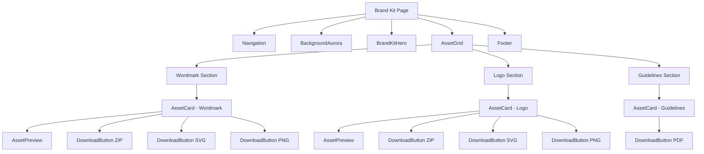

# Design Document: Brand Kit Page

## Overview

The Brand Kit page provides a professional, centralized resource for accessing Koopay's branding assets. Following the established design language of the landing page, it features a dark theme with gradient effects, glass-morphism cards, and responsive layouts. The page serves three main asset categories: Wordmark Logo, Logo (icon only), and Brand Guidelines, each with multiple download formats and preview capabilities.

## Architecture

The Brand Kit page follows Next.js App Router architecture with route-specific components organized in the `_components` folder structure. The system leverages existing reusable components (Navigation, Footer, BackgroundAurora) while introducing new specialized components for asset management and display.

### Component Hierarchy

```
/brand-kit (Route)
├── page.tsx (Main page component)
├── _components/
│   ├── BrandKitHero.tsx (Hero section with title and description)
│   ├── AssetSection.tsx (Individual asset category display)
│   ├── AssetCard.tsx (Card component for each asset)
│   ├── AssetPreview.tsx (Logo preview on different backgrounds)
│   ├── DownloadButton.tsx (Download functionality component)
│   └── AssetGrid.tsx (Grid layout for asset organization)
└── layout.tsx (Optional: Brand kit specific layout)
```

### Reused Components
- `Navigation` - Site-wide navigation with brand kit link
- `Footer` - Site-wide footer with brand kit link in resources section
- `BackgroundAurora` - Consistent visual background effects

## Components and Interfaces

### BrandKitHero Component
```typescript
interface BrandKitHeroProps {
  title: string;
  description: string;
}
```
Displays the main heading and description for the brand kit page, following the same typography and spacing patterns as the landing page hero sections.

### AssetSection Component
```typescript
interface AssetSectionProps {
  title: string;
  description: string;
  assets: BrandAsset[];
  className?: string;
}
```
Renders a section containing related brand assets with consistent spacing and layout.

### AssetCard Component
```typescript
interface AssetCardProps {
  asset: BrandAsset;
  showPreview?: boolean;
  className?: string;
}
```
Individual card component displaying asset information, preview, and download options with glass-morphism styling.

### AssetPreview Component
```typescript
interface AssetPreviewProps {
  logoSrc: string;
  logoAlt: string;
  showBothBackgrounds?: boolean;
  size?: 'sm' | 'md' | 'lg';
}
```
Displays logo previews on both dark and light backgrounds to demonstrate versatility.

### DownloadButton Component
```typescript
interface DownloadButtonProps {
  href: string;
  format: 'ZIP' | 'SVG' | 'PNG' | 'PDF';
  filename: string;
  variant?: 'primary' | 'secondary';
  size?: 'sm' | 'md' | 'lg';
  onClick?: () => void;
}
```
Handles download functionality with proper file serving and user feedback.

### AssetGrid Component
```typescript
interface AssetGridProps {
  children: React.ReactNode;
  columns?: 1 | 2 | 3;
  gap?: 'sm' | 'md' | 'lg';
  className?: string;
}
```
Responsive grid layout that adapts to different screen sizes.

## Data Models

### BrandAsset Interface
```typescript
interface BrandAsset {
  id: string;
  name: string;
  description: string;
  category: 'wordmark' | 'logo' | 'guidelines';
  previewSrc?: string;
  previewAlt?: string;
  downloads: AssetDownload[];
  featured?: boolean;
}
```

### AssetDownload Interface
```typescript
interface AssetDownload {
  format: 'ZIP' | 'SVG' | 'PNG' | 'PDF';
  href: string;
  filename: string;
  size?: string;
  description?: string;
}
```

### Asset Configuration
```typescript
const BRAND_ASSETS: BrandAsset[] = [
  {
    id: 'wordmark-logo',
    name: 'Wordmark Logo',
    description: 'Full logo with Koopay text for primary brand usage',
    category: 'wordmark',
    previewSrc: '/logo.svg',
    previewAlt: 'Koopay wordmark logo',
    featured: true,
    downloads: [
      {
        format: 'ZIP',
        href: '/brand-assets/koopay-wordmark-logo.zip',
        filename: 'koopay-wordmark-logo.zip',
        description: 'All formats included'
      },
      {
        format: 'SVG',
        href: '/logo.svg',
        filename: 'koopay-wordmark-logo.svg',
        description: 'Vector format'
      },
      {
        format: 'PNG',
        href: '/brand-assets/koopay-wordmark-logo.png',
        filename: 'koopay-wordmark-logo.png',
        description: 'High resolution PNG'
      }
    ]
  },
  {
    id: 'icon-logo',
    name: 'Logo',
    description: 'Icon-only logo for compact usage and favicons',
    category: 'logo',
    previewSrc: '/mini-logo.svg',
    previewAlt: 'Koopay icon logo',
    featured: true,
    downloads: [
      {
        format: 'ZIP',
        href: '/brand-assets/koopay-icon-logo.zip',
        filename: 'koopay-icon-logo.zip',
        description: 'All formats included'
      },
      {
        format: 'SVG',
        href: '/mini-logo.svg',
        filename: 'koopay-icon-logo.svg',
        description: 'Vector format'
      },
      {
        format: 'PNG',
        href: '/brand-assets/koopay-icon-logo.png',
        filename: 'koopay-icon-logo.png',
        description: 'High resolution PNG'
      }
    ]
  },
  {
    id: 'brand-guidelines',
    name: 'Brand Guidelines',
    description: 'Complete brand usage guidelines and specifications',
    category: 'guidelines',
    downloads: [
      {
        format: 'PDF',
        href: '/brand-assets/koopay-brand-guidelines.pdf',
        filename: 'koopay-brand-guidelines.pdf',
        description: 'Complete brand guide'
      }
    ]
  }
];
```

## Visual Design System

### Color Scheme
Following the established design system:
- **Background**: `#0a0014` (--background)
- **Card backgrounds**: `#16132c` with transparency (--card)
- **Primary gradient**: `linear-gradient(90deg, #5755ff 0%, #0e3cff 100%)` (--gradient-1)
- **Text colors**: `#ffffff` (primary), `#a3a3a3` (muted)
- **Border colors**: `rgba(255, 255, 255, 0.15)` for glass-morphism effects

### Typography
- **Font family**: Aeonik (--font-aeonik)
- **Hero title**: `text-4xl md:text-5xl lg:text-6xl font-bold`
- **Section titles**: `text-2xl md:text-3xl font-semibold`
- **Asset names**: `text-xl font-semibold`
- **Descriptions**: `text-zinc-400/85 leading-relaxed`

### Spacing and Layout
- **Container max-width**: `max-w-6xl mx-auto`
- **Section spacing**: `py-16 md:py-20`
- **Card padding**: `p-6 md:p-8`
- **Grid gaps**: `gap-6 md:gap-8`

### Glass-morphism Effects
```css
.glass-card {
  background: rgba(22, 19, 44, 0.6);
  border: 1px solid rgba(255, 255, 255, 0.12);
  backdrop-filter: blur(20px);
  box-shadow: 0 25px 80px -60px rgba(79, 70, 229, 0.75);
}
```

### Responsive Breakpoints
- **Mobile**: `< 768px` - Single column layout
- **Tablet**: `768px - 1024px` - Two column layout
- **Desktop**: `> 1024px` - Three column layout for asset grid

## Page Layout Structure



## Correctness Properties

*A property is a characteristic or behavior that should hold true across all valid executions of a system—essentially, a formal statement about what the system should do. Properties serve as the bridge between human-readable specifications and machine-verifiable correctness guarantees.*

Based on the prework analysis, the following properties validate the testable acceptance criteria:

**Property 1: Asset information completeness**
*For any* brand asset displayed on the page, the asset card should contain name, description, and available format information
**Validates: Requirements 2.4**

**Property 2: Asset preview availability**
*For any* brand asset that has a preview image, the preview component should display the asset with proper src attributes
**Validates: Requirements 2.5**

**Property 3: Download functionality**
*For any* download button on the page, clicking it should initiate the appropriate file download with correct href and filename attributes
**Validates: Requirements 3.4**

**Property 4: Format indication consistency**
*For any* asset type, all available download formats should be clearly indicated and accessible to users
**Validates: Requirements 3.5**

**Property 5: Responsive layout adaptation**
*For any* viewport size change, the layout should adapt appropriately with mobile showing stacked cards and desktop showing grid layout
**Validates: Requirements 5.1**

**Property 6: Missing asset graceful handling**
*For any* invalid or missing asset path, the system should handle the error gracefully without breaking the page functionality
**Validates: Requirements 7.5**

<function_calls>
<invoke name="prework">
<parameter name="featureName">brand-kit